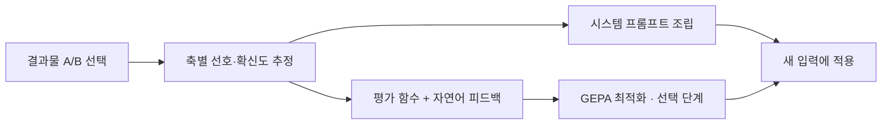

# 윤정우 | AI Engineer Portfolio

**업무 맥락을 이해하고, 모델의 결과를 검증하며, 사용자가 쓰는 서비스로 연결합니다.**

신한대학교 소프트웨어융합학과 · 졸업예정  
Language AI · 모델 학습 및 평가 · 업무용 AI 서비스 개발

AI 에이전트 행동 예측 모델, 선택 기반 프롬프트 생성 도구, 기업의 견적 업무 보조 시스템, 투자 판단 학습 플랫폼을 개발했습니다. 모델을 만드는 과정과 그 결과를 신뢰할 수 있는지 확인하는 과정을 함께 다뤄왔습니다.

[GitHub](https://github.com/a77315829-byte) · [프롬프트 도구 데모](https://preference-prompt-tool-7c9fvm3tb5bfxv8v6648fu.streamlit.app/)

## 핵심 프로젝트

| 프로젝트 | 본인 역할 | 확인할 수 있는 역량 | 결과 |
|---|---|---|---|
| [선호 기반 프롬프트 생성](#01-preference-prompt-tool) | 3인 팀장 · 프롬프트 생성 및 평가 방식 개선 | 선호 추정, LLM 활용, 평가 지표 설계 | MVP 구현 · 비교 실험 및 한계 분석 |
| [AI 에이전트 행동 예측](#02-ai-agent-action-prediction) | 5인 팀장 · 모델 개발과 검증 | LoRA, 지식 증류, LightGBM, 그룹 검증 | DACON 48위 · 상위 18% |
| [AI 견적 업무 보조](#03-openmoon) | 기업협력 인턴 · 초기 설계, 웹 UI, 챗봇 보완 | 업무 데이터 연계, 대화 맥락, 도구 호출 | 팀 시스템 구현 · 사내 설치·사용 안내 지원 |
| [ANTITUDE · RAISE](#04-antitude--raise) | 5인 팀장 · 기획, 웹 개발, AI 기능 통합 | 서비스 통합, 평가 결과의 피드백 연결 | PlatCon-26 Best Paper Award · 제2저자 |

## 역량과 구현 근거

| 역량 | 사용 기술·방법 | 대표 근거 |
|---|---|---|
| 언어모델 기반 분류 | Python, PyTorch, Transformers, LoRA/PEFT | Qwen2.5-Coder-0.5B 행동 분류기 |
| 모델 평가·실험 | scikit-learn, StratifiedGroupKFold, Macro-F1, ROUGE-L | 세션 분리, 유효하지 않은 실험 제외, 별도 평가 지표 비교 |
| LLM 활용 | 선호 추정, 프롬프트 조립, GEPA, Function Calling / Tool Use | 프롬프트 생성 도구, 견적 업무 보조 챗봇 |
| 서비스 구현 | FastAPI, React, TypeScript, Node.js, SQLite, MongoDB | 업무 화면, API 연동, AI 기능 통합 |

---

## 01. Preference Prompt Tool

**사용자의 선택에서 응답 선호를 추정해 재사용 가능한 프롬프트를 만드는 도구**  
2026.09 ~ 진행 중 · 3인 팀 / 팀장

[저장소](https://github.com/a77315829-byte/preference-prompt-tool) · [데모](https://preference-prompt-tool-7c9fvm3tb5bfxv8v6648fu.streamlit.app/)

### 문제와 본인 기여

사용자는 원하는 답변을 말로 설명하기 어려워도 두 결과물 중 더 나은 쪽을 고를 수 있습니다. 이 선택을 프롬프트로 변환하는 도구를 개발하며, 선호를 반영하는 방식과 그 효과를 평가하는 방법을 다뤘습니다. 특히 정답과 표현이 겹친다는 이유만으로 높은 점수를 주는 평가의 한계를 확인하고, 요약 길이와 원문 표현의 사용 정도를 직접 측정하는 방식으로 보완했습니다.

### 구현 흐름



- 8~10회 쌍대 비교를 통해 Bradley–Terry 방식의 온라인 업데이트로 축별 선호를 추정합니다.
- 선호와 확신도를 평가 함수로 변환하고, 축별 위반 내용을 자연어 피드백으로 제공합니다.
- 요약·이메일·리뷰·코딩 등 도메인 정의와 공통 엔진을 분리했습니다.
- LLM API를 활용하는 프로젝트이며, 기반 언어모델을 직접 학습하거나 파인튜닝하는 프로젝트는 아닙니다.

### 검증 결과와 해석

MACSum 기반 **문서 5개**에서 기록한 비교 결과입니다.

| 조건 | 자체 검사 점수 | 별도 비교 지표 ROUGE-L |
|---|---:|---:|
| 지침 없이 기본 호출 | 0.600 | 0.101 |
| 고정 일반 지침 | 0.668 | 0.168 |
| 8회 선택 후 프롬프트 조립 | 0.996 | 0.207 |

자체 검사 점수는 프롬프트 구성 목표와 같은 계열의 함수를 사용하므로 그 수치만으로 효과를 판단하지 않았습니다. 최적화에 사용하지 않은 ROUGE-L로도 비교했습니다. 표본이 작고 ROUGE-L도 참고 요약과의 표현 겹침을 측정하므로, 이 결과를 사용자 만족도나 일반적인 품질 우위로 해석하지 않습니다.

**위 표의 프롬프트 조립 조건에는 GEPA가 적용되지 않았습니다.** 별도 GEPA 실험의 상세 피드백 0.98 / 점수만 제공 0.44는 최적화에 사용한 평가 함수의 소규모 단일 실험 결과입니다. 두 실험의 효과를 구분해 기록했습니다. 사람 라벨과 검사 함수의 불일치, specificity 축의 측정 실패도 분석했습니다.

**코드·실험 근거:** [선호 추정](https://github.com/a77315829-byte/preference-prompt-tool/blob/master/engine/estimator.py) · [평가 함수](https://github.com/a77315829-byte/preference-prompt-tool/blob/master/engine/metric_builder.py) · [속성 검사](https://github.com/a77315829-byte/preference-prompt-tool/blob/master/checks/summarization.py) · [비교 실험](https://github.com/a77315829-byte/preference-prompt-tool/blob/master/experiments/compare_baselines.py) · [결과 CSV](https://github.com/a77315829-byte/preference-prompt-tool/blob/master/experiments/results/baseline_comparison.csv)

<details>
<summary>화면 보기 — React 결과물 비교 (2026.09.27)</summary>


</details>

---

## 02. AI Agent Action Prediction

**대화와 도구 사용 이력으로 AI 에이전트의 다음 행동 14종을 예측**  
2026.07 · 5인 팀 / 팀장 · 모델 개발 및 검증

[저장소](https://github.com/a77315829-byte/AI-Agent-Action-Prediction) · [결과 보고서](https://github.com/a77315829-byte/AI-Agent-Action-Prediction/blob/main/docs/RESULT_REPORT.md)

### 문제와 접근

70,000개 학습 샘플에는 같은 작업 세션의 여러 단계가 포함돼 있습니다. 행 단위 무작위 분할로는 유사한 맥락이 학습과 검증에 동시에 들어갈 수 있어, 세션 ID를 기준으로 분리했습니다.

- Qwen2.5-Coder-0.5B-Instruct를 LoRA로 학습하고 현재 문맥·행동·이력 구간을 나눠 pooling했습니다.
- 구조화 특징과 행동·상위 분류 head를 결합했습니다.
- OOF teacher 확률을 이용한 지식 증류와 LightGBM 확률 블렌딩을 비교했습니다.
- 세션 단위 `StratifiedGroupKFold`와 검증 집합 간 그룹 중복 검사를 적용했습니다.

### 결과와 기술적 판단

**대회 48위 / 상위 18% · 최종 Public Macro-F1 0.7893958473**

| 시도 | 관찰 | 판단 |
|---|---|---|
| Qwen + LightGBM | Tree 비중 0.15에서 공개 평가 최고점 | 최종 구성으로 선택 |
| 세션 경로 Viterbi 후처리 | OOF 개선이 실제 추론 입력 구조에서 재현되지 않음 | 사용 가능한 정보가 달라 제외 |
| 1.5B 모델 확대 | 검증 성능 및 제출 용량 측면에서 불리 | 0.5B 구성 유지 |

개선되지 않은 실험도 기록했습니다. 특히 초기 체크포인트가 검증 행을 이미 본 일부 student fold 결과를 발견해 유효한 비교에서 제외했습니다. **그룹 분리 원칙을 적용한 것과 최종 student의 독립 5-fold 검증을 완수한 것은 다르며**, 후자는 완료하지 못한 한계로 명시했습니다.

**코드·실험 근거:** [Qwen 학습·세션 분리](https://github.com/a77315829-byte/AI-Agent-Action-Prediction/blob/main/src/core/train_qwen_segment_v4.py) · [지식 증류](https://github.com/a77315829-byte/AI-Agent-Action-Prediction/blob/main/src/core/train_qwen_distill_v12.py) · [실험 로그](https://github.com/a77315829-byte/AI-Agent-Action-Prediction/blob/main/docs/EXPERIMENT_LOG.md) · [제외한 실험과 이유](https://github.com/a77315829-byte/AI-Agent-Action-Prediction/blob/main/docs/INVALID_EXPERIMENTS.md)

---

## 03. OPENMOON

**주문 메일·첨부 문서·견적 이력을 연결하는 AI 견적 업무 보조 시스템**  
2026.08.03 ~ 2026.09.07 · ㈜열린문디자인 기업협력 인턴 · 3인 팀

[초기 설계 저장소](https://github.com/a77315829-byte/yullin-moon-design) · [최종 팀 저장소](https://github.com/kimhonggyeong/OPENMOON_FRONT) · [본인 계정의 팀 버전 fork](https://github.com/a77315829-byte/yullinmoondesign_)

### 문제와 본인 기여

담당자가 주문 메일과 첨부파일을 읽고 과거 견적·단가표를 확인하는 업무를 보조하는 시스템입니다. **초기 구조 설계, 웹 UI 구현, 챗봇 코드 수정과 대화 맥락 기능 보완**을 맡았습니다. 사내 설치 및 사용 안내도 지원했습니다.

담당자가 “저번처럼 해줘”라고 요청했을 때 이전 대화와 업무 정보를 활용할 수 있도록, 현재 질문과 앞선 맥락이 이어지는 흐름을 보완했습니다.

### 팀 시스템의 구조

```text
주문 메일·첨부파일 → 정보 추출 → 과거 견적·단가표 조회 → 견적 초안
                                              ↓
                                  누락·충돌 검토 → 담당자 승인

챗봇 요청 → 최근 대화·누적 요약·업무 기억 → 필요한 도구 호출 → 응답
```

- FastAPI·SQLite·SQLAlchemy와 React·TypeScript 기반으로 구성했습니다.
- 메일별 챗봇은 최근 대화, 긴 대화의 요약, DB에 저장한 업무 기억을 활용합니다.
- 업무 기억은 고객·품목 등의 조건을 활용하는 관계형 DB 조회 방식으로 구성돼 있습니다.
- 누락 정보와 가격 근거 충돌은 검토 대상으로 분리하고, 담당자 승인 전 발송을 차단하는 절차를 포함합니다.

위 구조는 **팀 시스템 전체**의 설명이며, 본인 기여는 앞서 명시한 설계·UI·챗봇 보완 범위입니다.

**구현 근거:** [대화·요약·도구 연결](https://github.com/a77315829-byte/yullinmoondesign_/blob/main/backend/app/services/agent_service.py) · [업무 기억 저장·조회](https://github.com/a77315829-byte/yullinmoondesign_/blob/main/backend/app/services/memory_service.py) · [팀 시스템 설명](https://github.com/a77315829-byte/yullinmoondesign_/blob/main/README.md)

---

## 04. ANTITUDE / RAISE

**수익률뿐 아니라 투자 판단의 근거를 돌아보는 학습 플랫폼**  
2026.03 ~ 진행 중 · 5인 팀 / 팀장

[캡스톤 저장소](https://github.com/a77315829-byte/Capstone-ver0.1) · [해커톤 확장 버전](https://github.com/a77315829-byte/antitude-defense)

### 문제와 본인 기여

사용자가 뉴스를 해석하고 매매 판단의 근거를 작성한 뒤, 판단 과정에 대한 피드백을 받을 수 있는 학습 환경을 만들었습니다. **팀장으로 기획·웹 개발·AI 기능 통합**을 맡아 KIS Open API 시세와 학습 기능을 연결했습니다. 팀원들이 개발한 평가 기능을 사용자 답변 입력부터 화면 피드백까지 이어지도록 통합했습니다.

### 개선 과정

인공지능 루키 대회 예선 탈락 후 제안서를 다시 검토하고, 평가 기준과 검증 근거를 보완했습니다. 팀과 함께 핵심 정보 파악·해석·위험 인식·행동과 근거의 일관성·논리 연결을 구체화하고, 규칙 기반 점수와 사람의 평가를 비교했습니다. 제 역할은 보완한 구조를 서비스 기획과 웹 기능에 반영하는 것이었습니다.

현재 공개 코드는 규칙 기반 채점과 AI 해설을 구분하며, React·TypeScript / Node.js / FastAPI / MongoDB로 구성돼 있습니다. 현재 서비스 구현과 수상 논문의 연구 시점·범위는 구분합니다.

### 성과

- **PlatCon-26 Best Paper Award**, 2026.08.25 — 「RAISE: Rational-Aware Investment Scoring and Evaluation」 **제2저자**
- **2026 SW Start-Up Festa SW 해커톤 경진대회 총장상**, 2026.09.02 — 전역자금 플래너로 확장한 팀 프로젝트

**구현 근거:** [시나리오 API 연동](https://github.com/a77315829-byte/Capstone-ver0.1/blob/main/app/src/services/scenario.service.ts) · [팀 채점 엔진](https://github.com/a77315829-byte/Capstone-ver0.1/blob/main/services/scenario-server/scoring/engine.py) · [전체 구조와 실행 안내](https://github.com/a77315829-byte/Capstone-ver0.1/blob/main/README.md)

---

## 추가 경험

| 프로젝트·활동 | 내용과 역할 | 근거 |
|---|---|---|
| AI 생성 텍스트 판별 | 4인 팀 참여. KULLM 교정, BARTScore 비교, KoELECTRA 분류를 활용한 NLP 프로젝트 | [코드·대회 기록](https://github.com/a77315829-byte/AI-Generated-Text-Detection) |
| MOLE | 논문 검색 화면·공통 Unity UI 담당. PubMed 검색 결과와 한국어 번역을 화면에 연결. 2025 신한대학교 창업경진대회 금상 | [담당 기능과 코드 안내](https://github.com/a77315829-byte/MOLE) |
| FLYHIGH Drone GCS | Python·MAVLink·ArduPilot SITL 기반 교육 프로그램 단독 개발. 프로그램 저작권 등록 제C-2026-031893호 | [코드·실습 화면](https://github.com/a77315829-byte/flyhigh-drone-gcs) |
| 라오스 SW·AI 멘토링 | 현지 대학생 대상 AI 텍스트 판별 교육 및 Unity·ML-Agents 기반 프로젝트 멘토링. 담당 팀 최종 발표 1위 | [교육에 활용한 저장소](https://github.com/a77315829-byte/SoccerMirrorGame) |

## 다음 학습 방향

Language AI에서 쌓은 데이터 처리·모델 검증·서비스 연결 경험을 바탕으로, 주문·재고·이동 데이터와 운영 제약을 이해하는 예측·최적화 과제로 역량을 넓히고자 합니다. 물류 최적화와 GNN은 앞으로 학습하고 적용할 분야이며, 수행한 프로젝트와 구분합니다.

---

기준일: 2026.09.27. 실험 수치는 각 저장소에 기록된 결과이며, 재현에 필요한 대회 데이터·모델 가중치·외부 API는 저장소별 안내를 따릅니다. 팀 프로젝트의 성과와 본인 담당 범위는 구분해 기재했습니다.
